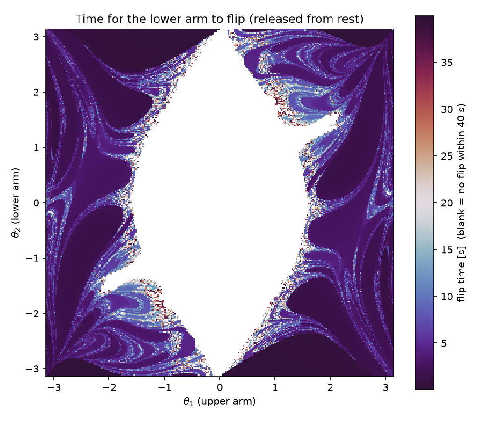
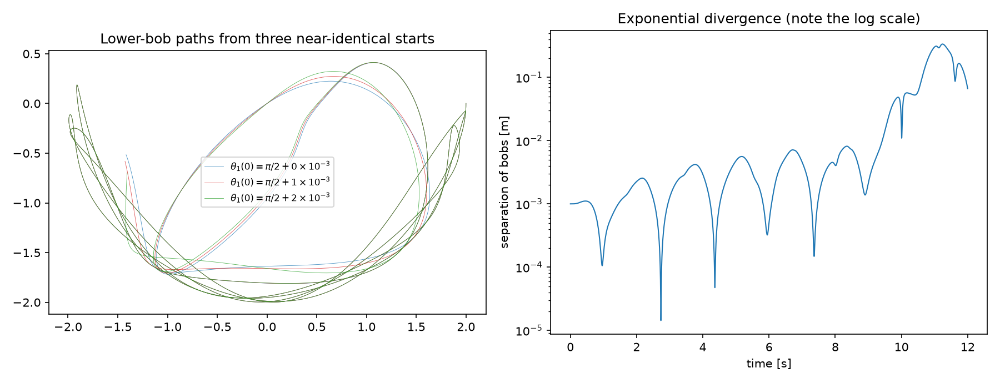

# chaoslab


**A double-pendulum chaos explorer: exact Lagrangian dynamics, Lyapunov
exponents, and the fractal flip-time map — with a test suite anchored to
analytic mechanics.**



The image above colors each pair of release angles (θ₁, θ₂) by how long the
lower arm takes to flip over. The smooth central lens is the region that
*provably cannot* flip (too little energy); everything outside it is fractal —
a direct picture of sensitive dependence on initial conditions.



## Why it's more than a pretty picture

The dynamics are the full nonlinear Lagrangian equations of motion (no
small-angle approximation), and the tests pin the solver to things known in
closed form:

- **Normal-mode frequencies.** Linearized, the equal double pendulum has two
  modes at ω² = (g/l)(2 ± √2) with amplitude ratio θ₂/θ₁ = ∓√2. The suite
  excites each mode at 10⁻³ rad and recovers its period to 0.1%.
- **Energy conservation.** RK4 holds total energy to < 10⁻⁴ over 200k steps,
  even on a chaotic π/2–π/2 release and on asymmetric mass/length configs.
- **The Lyapunov exponent has the right sign.** Benettin renormalization
  gives λ_max > 1 s⁻¹ for the chaotic high-energy start and |λ_max| < 0.2 for
  a quasi-periodic low-amplitude start — chaos quantified, not just asserted.
- **Fixed points and reference energy**: the hanging state is stationary to
  machine precision; the rest energy equals the analytic potential.
- Vectorized dynamics (a whole grid of pendulums in one call) are checked
  against the per-state loop — that's what makes the 300×300 flip map tractable.

## Install & use

```bash
pip install -e ".[dev]"
```

```python
import numpy as np
from chaoslab import DoublePendulum, integrate, largest_lyapunov

dp = DoublePendulum()
state0 = np.array([np.pi/2, np.pi/2, 0.0, 0.0])
print(largest_lyapunov(dp, state0))          # > 1  (chaotic)
traj = integrate(dp, state0, dt=1e-3, n_steps=10_000)
```

Regenerate the figures:

```bash
python examples/flipmap.py        # the fractal flip-time map
python examples/divergence.py     # three near-identical starts diverging
```

## Tests

```bash
pytest -q     # 13 tests, incl. the analytic normal-mode + Lyapunov validations
ruff check .
```
